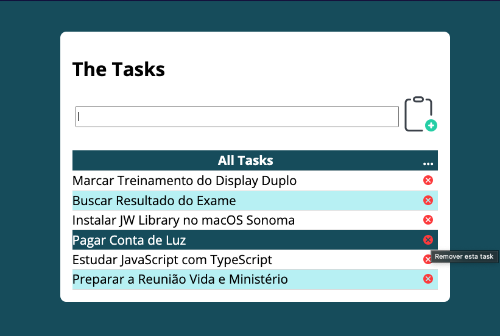

# Task List

## Simple Task List !

## Goal :star2:
- [x] Start studying the javascript stack
- [x] Exercise basic knowledge acquired
- [x] Helping those who are also learningHelping those who are also learning

> [!TIP]
> [Click on the image bellow to test the app](https://marinhotjr.github.io/tasklist/)

## Resources Used
> * HTML, CSS
>
> * DOM Manipulation
>
> * Javascript Functions
>
> * Event Handling (click and keypress)
>
> * Array Serializaztion in JSON and Deserialization
>
> * Browser LocalStorage

### Credits
> [!NOTE]
> App suggested as an exercise in the js course [Otávio Miranda - Udemy](https://www.udemy.com/course/curso-de-javascript-moderno-do-basico-ao-avancado/?couponCode=ST2MT43024)

**Made with love :heart: by @marinhotjr - 2024**